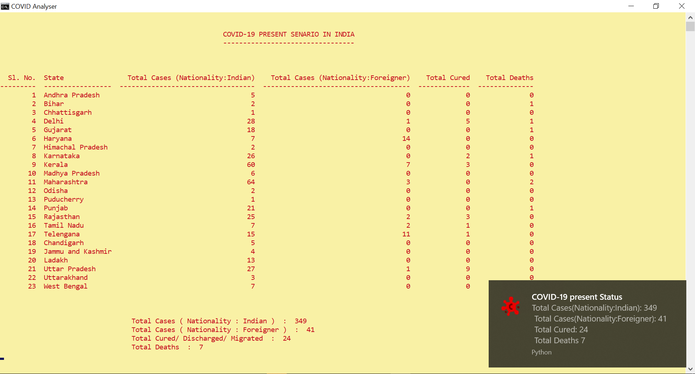

# Coronavirus Disease (COVID-19) Desktop Notifier



## Features

- It will run in background and will give you a summary of COVID every 30 mins as a Desktop notification.
- Also an elaborate list of all cases throughout India will be available in the program window.
- It gets inforation from the official [Ministry Health and Family Welfare website](https://www.mohfw.gov.in/). So its reliable.

## Installation

- **This will only run in windows OS. Not compatible with linux or mac.**
- You need python. You can install it from [here](https://www.python.org/downloads/).
- That's it no need to worry about dependencies 😉.It will automatically install those for you.
- Open cmd and enter the following command :

```bash
python bot.py
```

- That's it be updated about COVID-19 and stay safe.
